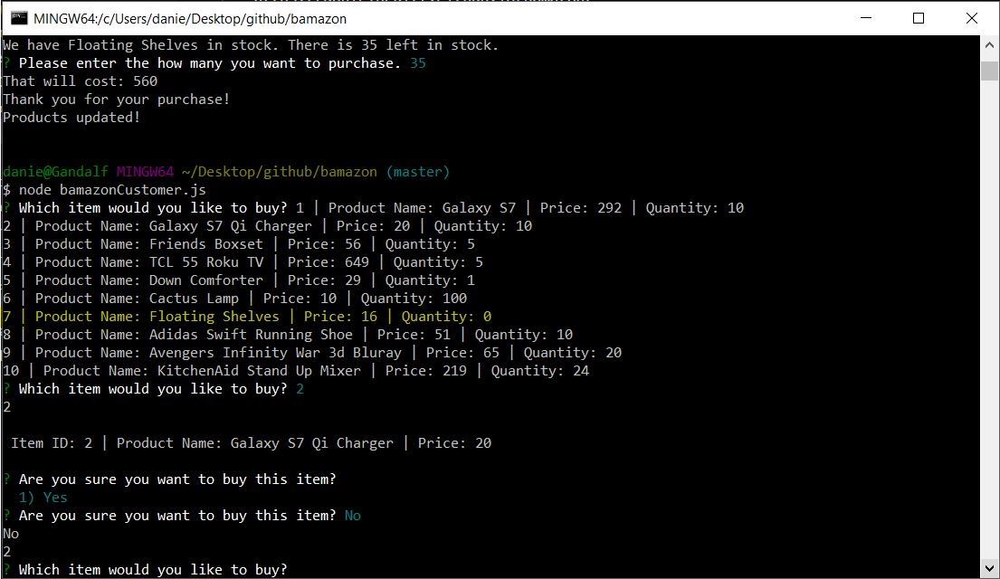

# Bamazon

https://danielpruitt.github.io/bamazon/

# BamazonCustomer
How it works: 
-Bamazon is a client line input Node app that utilizes Sql and Inquirer to provide data and input to the user. 
-The logic is stored in bamazonCustomer.js and the products are stored in the database bamazon_db. The schema and seeds are attached to the repository. 
-To run the Bamazon app node must be available and the dependencies "mysql" and "inquirer" need to be installed. 
-BamazonCustomer allows a user to see a list of items in the database, make a selection for the item they want, and then buy their option and how many they would like. 

Below is a link of Bamazon in use. 
https://drive.google.com/file/d/19yUr-_anmPtLrnFIQGbhT2-whWylWzMB/view

Images:
This is the inital response upon opening Bamazon, the user will then user the ID to make a selction.
;

Following the selection, user is prompted if they are sure they want that product. If yes, Bamazon continues to ask for the quantity.

The Stock Quantity of the purchase is decremented from the purchase and when Bamazon is loaded another time the new Stock Quantity is updated. 

If ther is not enough stock for the selection the user will be prompted and asked to make a smaller/another selection.

#BamazonManager

How it works: 
-Bamazon is a client line input Node app that utilizes Sql and Inquirer to provide data and input to the user. 
-The logic is stored in bamazonManager.js and the products are stored in the database bamazon_db. The schema and seeds are attached to the repository. 
-To run the Bamazon app node must be available and the dependencies "mysql" and "inquirer" need to be installed.
-BamazonManager allows access to see the inventory, see low stock, replenish stock(whether it is low or high), and add new products. 

Below is a link to see BamazonManager in use.
https://drive.google.com/file/d/1yHQP3r0SVQKKeKg0qRBxSjAf6BycdGFP/view

BamazonManger Started:
;

Products listed:
;

New product added:
;

Low inventory:
;

Inventory added:
;

